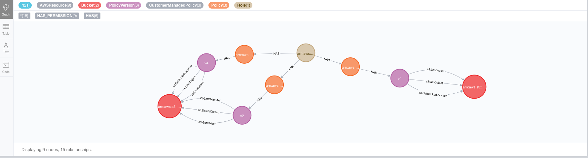
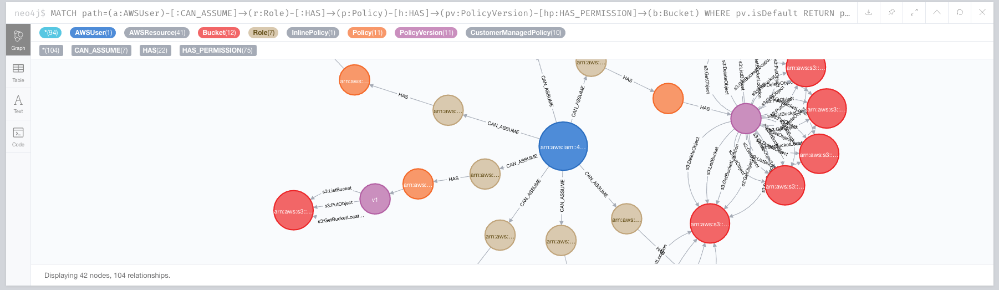
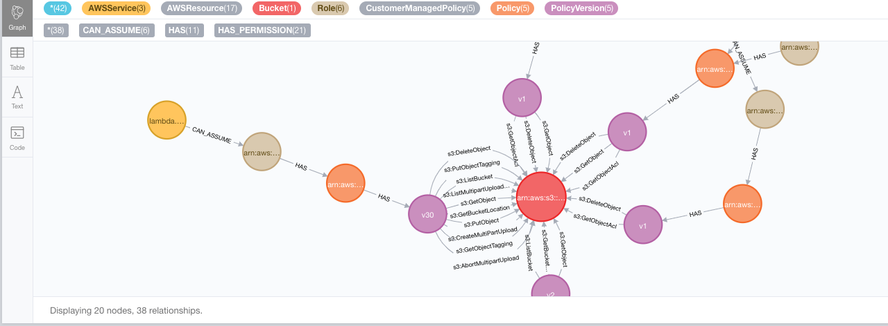

# Mia

Get a birds-eye view of your IAM authorization structure. Currently focused at AWS and Postgres. Quickly answer questions like:

- Who or what as access to resource S3 bucket `X`?
- Which AWS IAM Role can read from RDS Postgres table `mytable`?
- Which AWS IAM policy statement contain non-empty `NotResource` statements?
- What is the shortest path to read from `X` and write to `Y`?
- Which role provides access most resources?
- With whom or what should I collude to get access to data in `X`?

Mia uses various AWS API's to fetch your current account state. This is then ingested in a Neo4j database. You can then use the Neo4j web interface to run some of the suggested queries below.

## What Mia is not

Primarily, Mia is a tool to visualize existing resources and their relations to your IAM model. This means that it's not a policy simulator as Mia is not able to reason about non-existing resources. Theoretically you could build such queries but that would mean you're basically building a policy simulator on top of Mia. So, use Mia to evaluate your IAM model and run some sanity checks. Don't be angry when something isn't right; better use that energy to help improve Mia :).

### AWS caveats

Beware that the following IAM statements aren't (yet) handled:

- `NotResource`. Together with `NotAction` these could be implemented when building relations.
- `Condition`. This will be hard to implement in a graph setting. It would have to be considered at query-time as the outcome of a possible allow relation to a resource very much depends on the context of the action.
- Cross-account relations are currently not verified to be working.
- Permissionboundaries aren't handled
- [Policy variables](https://docs.aws.amazon.com/IAM/latest/UserGuide/reference_policies_variables.html) are not supported

## Running

1. Clone this repo and run `npm install`
1. Run `docker-compose up`
1. Run `npm run build`
1. Create a config file based on `mia-targets.example.json`
1. Run `node dist/index.js -c <path/to/your/config>.json`. Make sure that the user/role you're running Mia with has enough permissions on all systems to read and detect all resources!
1. (Run `node index.js -h` to see the other options)
1. Visit Neo4J web interface at `http://localhost:7474/`. You can connect without auth
1. Run one of the suggested queries below.

## Useful queries

Use one of the queries below to get some insights through the Neo4j web interface. Note that these queries are opitmized for this web interface meaning that they return the required results such that a nice visual graph can be rendered. Usually, you would probably not be interested in a complete path but only parts of it. Be ware that some query results may take a while to visualize. You'll notice from the fan sound of your computer.

### Show all nodes of a type

Neo4j works with node labels. We use this to distinguish between AWS resources such as Role, Bucket, Policy, Lambda and so forth. Nodes can have multiple labels which we use to support a liberal way of polymorphism. For instance, we have a `Policy` label but also more specific `InlinePolicy`, `AWSManagedPolicy` and `CustomerManagedPolicy` that you can use to narrow down a query. To get a list of all node labels execute:

```cypher
CALL db.labels()
```

To then show all nodes that have a label (e.g AWSRole) execute:

```cypher
MATCH (r:AWSRole) RETURN r
```

### Schema visualization

You can use the following queries to also view al relationship types: `CALL db.relationshipTypes()`. Besides that, you can run `CALL db.schema.visualization()` for a visualization of the node and relationships types currently active.

### Show all IAM roles that have access to a Postgres table

```cypher
MATCH p=(:AWSRole)-[*]->(:PostgresTable) RETURN p
```

Or when this query takes too long because you have many AWS resources:

```cypher
MATCH path=(:AWSRole)-[:HAS]-(p:AWSPolicy)-[:HAS]-(pv:AWSPolicyVersion)-[*]
->(:PostgresTable) RETURN path
```

### Check if two buckets are completely isolated from an IAM perspective

```cypher
MATCH p=(b1:AWSBucket)<-[:HAS_PERMISSION]-(pv1:AWSPolicyVersion)<-[*]-(r:AWSRole)-[*]->(pv2:AWSPolicyVersion)-[:HAS_PERMISSION]->(b2:AWSBucket)
WHERE b1.name = 'a' AND b2.name = 'b'
AND pv1.isDefault AND pv2.isDefault
RETURN p
LIMIT 5
```

Or when this query takes too long because you have many AWS resources:

```cypher
MATCH p=(b1:AWSBucket)<-[:HAS_PERMISSION]-(pv1:AWSPolicyVersion)<-[:HAS]-(:AWSPolicy)<-[:HAS]-(r:AWSRole)-[:HAS]->(:AWSPolicy)-[:HAS]->(pv2:AWSPolicyVersion)-[:HAS_PERMISSION]->(b2:AWSBucket)
WHERE b1.name = 'a' AND b2.name = 'b'
AND pv1.isDefault AND pv2.isDefault
RETURN p
LIMIT 5
```



### Show which roles are allowed to perform action X on a bucket

Note the `regexAction` attribute here. We translate `s3:Get*` into `s3:Get.*` such that regex expressions are supported as well.

```cypher
// This may take a while to display!
WITH 's3:Put.*' AS regexAction
MATCH p=(r:AWSRole)-[*]->(pv:AWSPolicyVersion)-[hp:HAS_PERMISSION]->(b:AWSBucket)
WHERE pv.isDefault AND (regexAction =~ hp.regexAction OR hp.regexAction =~ regexAction)
RETURN p
LIMIT 5
```

Or a more refined version where you query which roles are able to reach `>n` buckets:

```cypher
MATCH (r:AWSRole)-[*]->(pv:AWSPolicyVersion)-[*]->(b:AWSBucket)
WITH r, COUNT(DISTINCT b) as bucketCount, collect(DISTINCT b.name) as buckets, pv
WHERE pv.isDefault AND bucketCount > 4
RETURN r.name, bucketCount, buckets
LIMIT 5
```

### Show which user can assume a role that provides access to a bucket

```cypher
MATCH path=(a:AWSUser)-[:CAN_ASSUME]->(r:AWSRole)-[:HAS]->(p:AWSPolicy)-[h:HAS]->(pv:AWSPolicyVersion)-[hp:HAS_PERMISSION]->(b:AWSBucket)
WHERE pv.isDefault
RETURN path
```



### Show all nodes that have a recently updated policy that provides access to a bucket

You can replace the label of `(a)` by any of the labels you've discovered above. So `(a:GlueJob)` would be another valid example.

```cypher
MATCH p=(a:AWSService)-[*]->(pv:AWSPolicyVersion)-[hp:HAS_PERMISSION]->(b:AWSBucket)
WHERE pv.isDefault
AND b.name = 'bucket-name'
AND pv.createdAt > datetime({year: 2020, month: 6, day: 1})
RETURN p
LIMIT 5
```



### Wipe database

You probably won't need this, but it can be useful anyway :)

```cypher
MATCH (a) DETACH DELETE a
```

## Comparing to existing AWS products

We compared Mia to existing product listing [here](https://aws.amazon.com/products/security/#AWS_Security.2C_Identity.2C_.26_Compliance_services). Conclusion is that existing products are mainly focused at response and detection, assuming that your AWS setup is correct. Mia is focused at verifying this assumption from an IAM perspective.

### AWS Config (Detection)

Continuously monitor and assess AWS _resource configurations_. Easily track changes and relate them to CloudTrail events. Mia is Config on steroids though with a focus on inter-resource relationships instead of resources themselves. Config is time oriented whereas Mia is current state oriented first. Time orientation could be added.

### AWS Detective (Incident response)

Consolidated views over Cloudtrail, VPC Flow Logs and GuardDuty findings to quickly come to the root cause of security findings or suspicious activities.

### Amazon GuardDuty (Detection)

"An intelligent threat detection service" aimed at monitoring access which are within configurations, strange in terms of behaviour (geo-location, atypical time of day, disabling audit functionality).

It uses AWS CloudTrail (including S3), VPC Flow Logs, and DNS Logs.

[Finding types](https://docs.aws.amazon.com/guardduty/latest/ug/guardduty_finding-types-active.html)

### IAM Access Analyzer (Identity & access management)

Lists external access to resources in your account. More specifically, it lists access to resources within the zone of trust of your access analyzer. Multiple analyzers can be created per account.

### AWS Security Hub (Detection)

Aggregates over GuardDuty, Macie Inspector, Firewall manager, IAM Access Analyzer and more to help prioritize and handle alerts coming out of those systems.

### Amazon Macie (Data protection)

Not applicable. Scans S3 buckets for PII and sensitive data.
